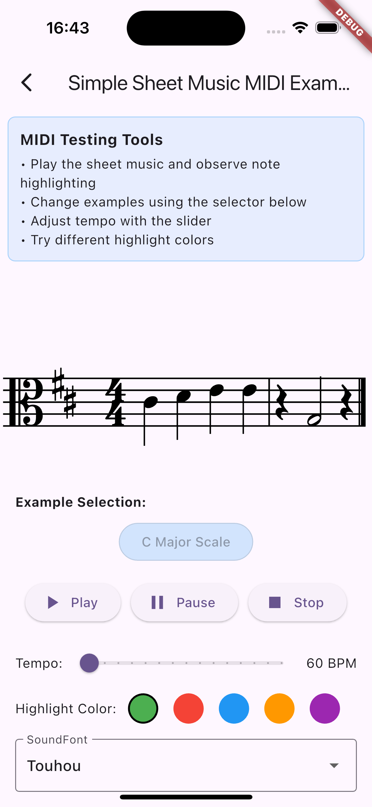

<!--
<!--
This README describes the package. If you publish this package to pub.dev,
this README's contents appear on the landing page for your package.

For information about how to write a good package README, see the guide for
[writing package pages](https://dart.dev/guides/libraries/writing-package-pages).
[writing package pages](https://dart.dev/guides/libraries/writing-package-pages).

For general information about developing packages, see the Dart guide for
[creating packages](https://dart.dev/guides/libraries/create-library-packages)
and the Flutter guide for
[developing packages and plugins](https://flutter.dev/developing-packages-and-plugins).
[developing packages and plugins](https://flutter.dev/developing-packages-and-plugins).
-->

This repository is part of the [Khuur](https://github.com/Tseku210/khuur_app) project, a Flutter application for learning and playing the Mongolian horse fiddle instrument (morin khuur). It extends the [simple_sheet_music](https://github.com/tomoyu719/simple_sheet_music) library with MIDI playback capabilities and missing music sheet logic. It adds support for playing sheet music through MIDI output.

    

## Acknowledgments

This library is inspired by the excellent [simple_sheet_music](https://github.com/tomoyu719/simple_sheet_music) repository developed by [@tomoyu719](https://github.com/tomoyu719). The original repository provides the core music rendering foundation.

This library is being developed as part of the [Khuur](https://github.com/Tseku210/khuur_app) project, a Flutter application for learning and playing the Mongolian horse fiddle instrument (morin khuur).

## Features

- Sheet music rendering with support for:
  - Staves and measures
  - Clefs (treble, alto, tenor, bass)
  - Notes and rests
  - Time signatures
  - Key signatures
- MIDI playback support
- Real-time music playback
- Customizable soundfont support

## License

MIT License

Copyright (c) 2025 Tseku210

Copyright (c) 2023 tomoyu719

Permission is hereby granted, free of charge, to any person obtaining a copy
of this software and associated documentation files (the "Software"), to deal
in the Software without restriction, including without limitation the rights
to use, copy, modify, merge, publish, distribute, sublicense, and/or sell
copies of the Software, and to permit persons to whom the Software is
furnished to do so, subject to the following conditions:

The above copyright notice and this permission notice shall be included in all
copies or substantial portions of the Software.

THE SOFTWARE IS PROVIDED "AS IS", WITHOUT WARRANTY OF ANY KIND, EXPRESS OR
IMPLIED, INCLUDING BUT NOT LIMITED TO THE WARRANTIES OF MERCHANTABILITY,
FITNESS FOR A PARTICULAR PURPOSE AND NONINFRINGEMENT. IN NO EVENT SHALL THE
AUTHORS OR COPYRIGHT HOLDERS BE LIABLE FOR ANY CLAIM, DAMAGES OR OTHER
LIABILITY, WHETHER IN AN ACTION OF CONTRACT, TORT OR OTHERWISE, ARISING FROM,
OUT OF OR IN CONNECTION WITH THE SOFTWARE OR THE USE OR OTHER DEALINGS IN THE
SOFTWARE.

