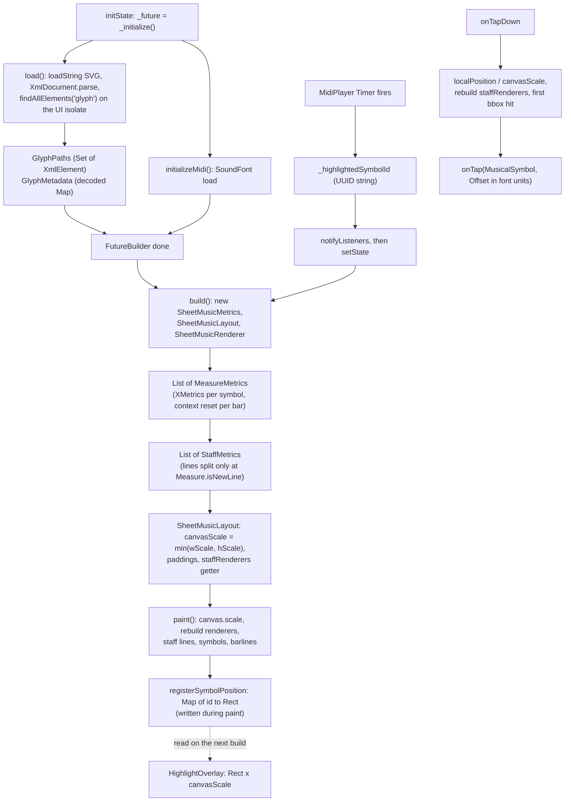
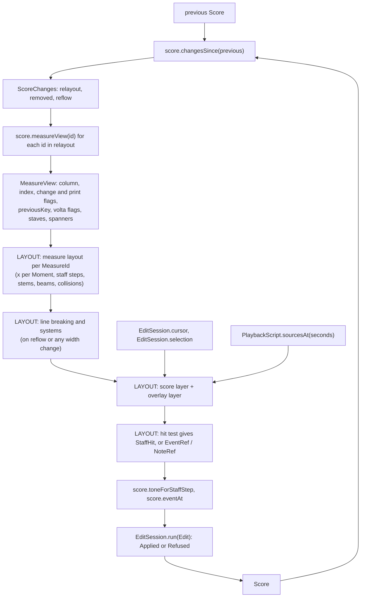

# Layout engine grounding for the simple_sheet_music rewrite

The package was renamed `khuur_sheet_music` on 2026-10-05. This document keeps the name it had when it was written.

Citations give `file:line` plus the symbol name, as of commit `37ac3a5`. Model paths are relative to `packages/score_model/`. In that commit:
- `lib/src/playback.dart` keeps the compiler and the public types. Its stages are in `playback_order.dart`, `playback_tempo.dart`, `playback_dynamics.dart`, `playback_attacks.dart` and `playback_pedal.dart`.
- The edits are applied in `edit/apply.dart`, `notes.dart`, `rhythm.dart`, `erase.dart`, `directions.dart`, `context.dart`, `transpose.dart` and `parts.dart`.

This grounding merges three traces: the old engine, the model's read surface, and the glyph assets with their consumers. Where the traces disagreed, the code decided. The SMuFL codepoints the model needs are in [glyphs.md](glyphs.md).

## Overview

`lib/` holds the current engine, about 5,000 lines in which model, layout and paint are fused.
- A `MusicalSymbol` carries a Flutter `Color`, an `EdgeInsets` margin and a random UUID. Its `setContext` returns a metrics object, and the metrics object returns the symbol's renderer.
- It draws one staff. Symbols sit one after another, and duration has no effect on spacing.
- It scales the whole score to fit a fixed `width × height` box.
- It lays out and repaints the whole score on every playback highlight tick.
- The consumer surface is small: the `SimpleSheetMusic` widget, the old `Measure` and symbol types, `FontType`, `SoundFont`, and play, pause, stop and tempo methods that the example app reaches through a `GlobalKey<SimpleSheetMusicState>`. `khuur_app` does not depend on the package today, so `example/lib/` is the only live consumer.

`packages/score_model` is the pure-Dart replacement for the domain half. Units 1 to 21 are done. `scoreFromMusicXml` is still a stub (`lib/src/io/musicxml.dart:50`). Layout reads the model through two calls, `Score.measureView` and `Score.changesSince`, plus the public domain types and a few queries.

`measureView` resolves the notation semantics of one bar:
- written pitch and the accidental to print
- ties and beam groups
- tuplet nesting
- which signatures print
- volta bracket ends
- spanner pieces per bar

It resolves no geometry. Layout still has to build every x position, staff step, stem, beam slope, collision, line break, per-system restatement, text placement and hit test. Five gaps need a model change, because the information is private to the model or already computed privately in its MusicXML exporter. A short list of convention questions needs the owner.

## Key Concepts

- **Staff space.** The unit of notation size. A SMuFL em is 1000 font units and 4 staff spaces, so one staff space is 250 units (`Constants.staffSpace`, `lib/src/constants.dart:2`). Metadata values are in staff spaces.
- **SMuFL metadata.** `assets/bravura_metadata.json` holds per-glyph `glyphBBoxes`, `glyphAdvanceWidths` (Bravura only), anchors in `glyphsWithAnchors` (such as `stemUpSE`), and 29 `engravingDefaults` (line thicknesses and spacings).
- **`Score`.** Immutable. It holds `measures: Seq<MeasureColumn>`, `parts: Seq<Part>`, `spanners: Seq<Spanner>` and `meta: ScoreMeta`. `Seq` equality is identity on purpose (`seq.dart`).
- **`MeasureColumn`.** One bar across all staves. It holds meter, concert key, `barline`, repeats, `volta`, `navigation`, `rehearsal`, `tempos`, `breakBefore: LayoutBreak?`, `keyDisplay`, `meterDisplay`, and `staves: Seq<StaffMeasure>`. Its constructor enforces that every voice fills the bar exactly.
- **`StaffMeasure`.** One staff of one bar: `clef` at bar start, `clefChanges`, `voices` and `directions` (`DynamicMark`, `TextMark`, `ChordSymbol`).
- **`Moment`, `Length`, `ScorePoint`, `VoicePoint`.** `Moment` is a point in a bar and `Length` is a span. Both are exact fractions. `ScorePoint(MeasureId, Moment)` is a point in the score. `VoicePoint(staff, voice, at)` adds a staff and a voice.
- **`MeasureView` and its children.** `MeasureView`, `StaffView`, `VoiceView`, `TimedEvent`, `TupletView`, `BeamGroup`, `TieView` and `SpannerSegment` are uncached read-only values built per call (`lib/src/views.dart`).
- **`ScoreChanges`.** `relayout`, `removed` and `reflow`. They say which bars to rebuild after an edit and are computed by pointer identity.
- **Staff step.** Step 0 is the bottom line of a 5-line staff, step 1 the first space, and negative steps are below the staff. `Clef.naturalAt(step)` and `Clef.staffStepOf(written)` convert between steps and pitches (`pitch.dart:339-349`).
- **`StaffHit`.** `({StaffId staff, ScorePoint at, int staffStep})`. It exists only as a typedef in `example/usage.dart:100`. The layout package owns the real hit type.
- **`PlaybackScript`.** Compiled playback. It offers `bars`, `notesBetween`, `sourcesAt(seconds)` and `secondsAt(ScorePoint)` (`playback.dart:249`).

## How It Works

### 1. The old engine, stage by stage

**Load.**
- `SimpleSheetMusicState.initState` sets `_future = _initialize()`, which awaits `load()` and then `initializeMidi()` (`lib/src/simple_sheet_music.dart:117-125`).
- `load()` (L127-134) runs `rootBundle.loadString(fontType.svgPath)`, then `XmlDocument.parse`, then `findAllElements('glyph').toSet()`, which builds `GlyphPaths`. It then decodes the metadata JSON into `GlyphMetadata`. All of this happens on the UI isolate, once per State, and the whole DOM stays reachable.
- `FontType` has `bravura` and `petaluma`, with prefixed paths (`lib/src/font_types.dart`).
- `GlyphPaths.parsePath` (`glyph_path.dart:13-25`) finds a glyph by a linear `firstWhere` on `glyph-name`, a `uniXXXX` codepoint name. It parses the `d` attribute with `svg_path_parser`, flips Y with `Matrix4.rotationX(pi)` (L21), and caches the result in a static `_cachedPaths` keyed by glyph name only (L10).
- `GlyphMetadata` reads four engraving defaults, each times 250: `staffLineThickness`, `legerLineExtension`, `legerLineThickness` and `stemThickness` (L18-34).
  - `minStemLength` comes from `glyphBBoxes.stem` and sits in a static `_cache` (L9, L36-46).
  - `stemRootOffset` uses the notehead anchors `stemUpSE` and `stemDownNW` (L53-60).
  - `flagRootOffset` uses the flag anchors `stemUpNW` and `stemDownSW` (L62-68).
  - Glyph widths come from `Path.getBounds()`, not from metadata.
- `FutureBuilder` shows a spinner until both the glyphs and the SoundFont have loaded (L157-162). `hasError` is never checked.

**Build** (L155-208).
- Each build constructs a new `SheetMusicMetrics`, `SheetMusicLayout` and `SheetMusicRenderer`.
- It returns `Stack[GestureDetector > CustomPaint(size: Size(widget.width, widget.height)), HighlightOverlay?]`. The size comes from the widget parameters, not from constraints.
- There is no `didUpdateWidget`. `fontType` is read once. The MIDI player keeps the measures it loaded at init, so edited measures re-render but play the old notes.

**Metrics.**
- `SheetMusicMetrics._measuresMetricses` (`sheet_music_metrics.dart:28-47`) creates one `MusicalContext(initialClef, initialKey)`.
- `Measure.setContext` (`measure.dart:41-54`) threads that context only within its own measure, so clef and key reset at every barline.
- Each symbol's `setContext` returns its `XMetrics`.
- `staffsMetricses` (L52-70) breaks lines only at `Measure.isNewLine`.
- `StaffMetrics.width` adds font units to pixels: `objectsWidth + horizontalMarginSum` (`staff_metrics.dart:23`).

**Layout.**
- `SheetMusicLayout.canvasScale` is `min(_widthScale, _heightScale)` (`sheet_music_layout.dart:94`). The whole score is fitted into the box, so staff size shrinks as content grows.
- The left padding centres the widest line, and the top padding centres the stack of lines.
- `staffRenderers` is a getter (L68) that stacks lines with no system gap.
- Symbols advance by `symbol.width + margin.horizontal / canvasScale` (`measure_metrics.dart:99-117`). A whole note gets the same advance as a quarter.
- Every metrics value is a recomputing getter, and `canvasScale` walks every symbol's bounds on each access, so paint is quadratic.

**Paint.**
- `SheetMusicRenderer.paint` applies `canvas.scale(canvasScale)` and renders. `shouldRepaint` compares layout identity (`sheet_music_renderer.dart:17`), and the layout is new on every build.
- `MeasureRenderer.render` (`measure_renderer.dart:41-55`) does three things in order:
  1. It draws five staff lines per measure.
  2. For each symbol, it calls `symbolPositionCallback(symbol, getBounds())` during paint and then renders the symbol.
  3. It draws the barline. A normal barline has width `staffLineThickness`. The final barline is thin plus thick, at 1x and 3x that thickness. The barline is skipped when this measure `isNewLine`.
- The canvas is in font units with Y down. Vertical position is counted in half-spaces from the middle line, `y = -(pos * 125)`.

**Symbol geometry worth knowing.**
- **Stems.** The stem root is the notehead's left edge plus the SMuFL anchor plus half the stem thickness. The stem length is `minStemLength`, which is 3.5 spaces in Bravura. A note far from the middle line gets a stem that reaches the middle line (`note.dart:201-205, 229-232`). The flag attaches at the tip by its anchor.
- **Ledger lines.** The count is `max(localPosition ~/ 2 - 2, 0)` (`positions.dart:56,66`).
- **Chords.** Accidentals are not stacked into columns. A second always moves to the right of the stem, whatever the stem direction.
- **Signatures.** The key signature ignores `margin.left`. The time signature uses single-digit glyphs, left-aligned.
- **Text.** No text is drawn anywhere.
- **Glyphs.** The engine uses exactly 37 glyphs: clefs E050, E05C and E062; noteheads E0A2-E0A4; flags E240-E249; accidentals E260-E264; rests E4E3-E4EA; time digits E082-E089.

**Tap.**
- `_handleTap` (`simple_sheet_music.dart:136-152`) divides `localPosition` by `canvasScale`.
- It rebuilds `staffRenderers` and returns the first symbol whose bbox contains the point.
- It calls `onTap(symbol, tapPosition)` with the offset in font units, not pixels.
- Nothing resolves a staff, time or staff step. A C major key signature has a zero-size rect and can never be hit.

**Playback highlight.**
- `MidiPlayer._playNextSymbol` (`midi_player.dart:222-269`) runs a chain of `Timer`s. It maps notes by index (`_midiKeys[measure][symbol]`) and highlights only a `Note` or a `Rest`.
- A `ChordNote` is silent and never highlighted, because `resolveMidiKeys` returns null for it (`midi_keys.dart:25`).
- Each change goes through `notifyListeners`, then `_updateHighlightedSymbol`, then `setState` (`midi_playback_mixin.dart:66-72`). That rebuilds metrics, layout and renderer.
- `HighlightOverlay` reads the `Map<String, Rect>` that the previous paint filled and scales it by `canvasScale`.
- The overlay's `CustomPaint` uses the default `hitTest`, which returns null and counts as a hit. So it absorbs taps inside the highlight before they reach the `GestureDetector` below (verified against the Stack and `RenderCustomPaint` hit-test order).

### 2. The model's read surface

**`Score.measureView(MeasureId)`** (`score.dart:323`) calls `buildMeasureView(score, index)` (`measure_view.dart:16`).
- It reads the previous column, its own column and the next one. From the next column it reads only the voices' opening events (tie targets) and `volta`.
- Nothing is cached, so every call recomputes. The cost is the bar's content plus a linear scan of all spanners.

What it resolves, member by member:

| Member | What the model resolves | What layout still does |
|---|---|---|
| `column` | The raw `MeasureColumn` | Reads barline, repeats, volta endings, navigation, rehearsal, tempos and `breakBefore` directly |
| `index` | Zero-based position | Bar numbers, including pickup numbering |
| `meterChanged`, `keyChanged` | Differs from the previous bar, or this is bar 0. The meter is compared with `==`; the key compares `fifths` only, so a mode-only change prints nothing (L36-37) | Nothing |
| `printsMeter`, `printsKey` | Changed, or `SignatureDisplay.restated` (`views.dart:58-65`) | Prints the clef and key at every system start (the `printsKey` doc says so) |
| `meterCourtesy`, `keyCourtesy` | `index > 0`, changed, and not `noCourtesy` (`views.dart:69-79`) | Applies them only when this bar starts a system, and draws them at the end of the system before |
| `previousKey` | The previous bar's **concert** key, null at bar 0 | Computes the written key with `part.instrument.writtenKey(previousKey!)` for cancellation naturals |
| `voltaStarts`, `voltaEnds` | Bracket ends, by comparing `Volta` with the neighbours (L39-40) | Labels from `Volta.endings`, the `open` hook, and splits at systems |
| `staves` | Visible staves only, in system order | Must iterate this list, not `column.staves`, which still includes hidden staves |
| `spanners` | `SpannerSegment(spanner, from, to, startsHere, endsHere)` on visible staves. Anchors are raw offsets, not snapped (`_segment`, L49-59) | Resolves ends to events, extends line ends, builds geometry |
| `isRestOnly` | Conservative candidacy for a multi-measure rest (`views.dart:88`) | Groups runs into multi-rests and ends a run before a `breakBefore` |
| `StaffView.clef`, `clefChanged` | The clef at bar start, and whether it differs from the previous bar's `clefAtEnd` (L134-135) | Draws a barline clef change at the end of the previous bar. Draws mid-bar `source.clefChanges` itself |
| `StaffView.writtenKey` | The concert key moved by the instrument's transposition, or C on percussion | Places the key-signature glyphs |
| `StaffView.writtenPitches` | A `Map<NoteId, Pitch>` with graces included. Applies transposition and 8va/15/22 lines (inclusive at both ends, L86-100). A drum gets its kit `position` | Computes the staff step with `source.clefAt(onset).staffStepOf(pitch)` |
| `StaffView.accidentals` | `AccidentalMark(alter, cautionary)` per head, resolved across all voices of the staff. A head absent from the map prints nothing (`_accidentals`, L265-310) | Chooses the glyph, including the quarter-tone family, and stacks accidentals into columns |
| `StaffView.ties`, `tiedIn` | `TieView(from: NoteId, to: NoteRef?, crossesBarline)`. `to == null` means a let-ring tie (`_ties`, L181-211) | Draws the curve, picks its direction, splits it at a system break |
| `StaffView.headOf(note)` | The `NoteHead`. A drum takes its kit sound's head | Picks the glyph |
| `VoiceView.events` | `TimedEvent(ref, voice, event, onset, duration, tuplets)` with tuplet-scaled times. Gaps are omitted, and graces ride on their principal | Turns times into x positions |
| `VoiceView.beams` | `BeamGroup(events: List<EventId>, secondaryBreaks)`. Only chord ids appear, and rests under a beam are skipped (`beaming.dart:24-27`) | Draws stems, slope and hooks, and places rests under beams |
| `VoiceView.tuplets` | `TupletView(tuplet, onset, duration, events, depth)` in pre-order | Draws the number, decides bracket visibility for `auto`, stacks brackets by `depth` |

`_staffView` (L61-156) builds each visible staff in this order:
1. It walks each voice with `timedEvents`.
2. It collects octave lines on that staff.
3. It computes the written pitch of every head.
4. It finds `tiedIn` from the previous bar's last event in each voice.
5. It resolves ties.
6. It resolves accidentals. Heads are read by onset, graces first at an onset, then in voice order. State is keyed by `Pitch.diatonic` and resets at the barline.
7. It computes beam groups.

**`Score.changesSince(previous)`** (`score.dart:334`).
- An identical score returns `ScoreChanges.none`.
- `removed` lists every column id that is gone.
- If `parts` is not the same object (add, remove, hide or show a part), every bar is relaid out and `reflow` is set.
- Otherwise each bar is checked:
  - A new bar is relaid out.
  - A bar that moved backward means a reorder, and every bar is relaid out.
  - A changed `breakBefore`, a changed bar count or a moved index sets `reflow`.
  - A bar is relaid out when it, or the bar before or after it by position, is a different object.
- Spanners are diffed with `Set.identity`. An added spanner relays out the bars it covers in the new score. A removed one relays out the surviving bars it covered.
- `meta` is never compared.

A scratch probe confirmed:
- A note in bar 5 relays out bars [4, 5, 6] with no reflow.
- A slur over bars 2 to 7 relays out exactly [2..7].
- A break on bar 4 relays out [3, 4, 5] and sets reflow.
- Hiding a part relays out every bar and sets reflow.
- Inserting before bar 3 relays out [2, 3, 4] and sets reflow.
- A meta-only change reports nothing.

**`Score.toneForStaffStep(staff, at, staffStep)`** (`score.dart:298`). This turns a hit into a tone.
- It reads `contextAt`, then `clef.naturalAt(step)`, then `writtenKey.alterFor(step)`, then transposes by `octaveShift` and `instrument.transposition` into a concert `Pitch`.
- On a percussion staff it returns the kit's first `Drum` whose position shares that diatonic step, or null.
- It ignores accidentals earlier in the bar. RATIONALE lists that as an open question.
- Probe results: treble step 0 is E4, bass step 0 is G2, alto step 4 is C4, the percussion clef reads like treble, and treble8vb puts C4 at step 5.

**Point and spanner queries** (`score.dart`):
- `eventAt(VoicePoint)` (L225): the event sounding at a point in one voice, or null in a gap.
- `anchorAt(staff, voice, ScorePoint)` (L238): `eventAt` in that voice, else in voice one.
- `isCollapsed` (L243).
- `contextAt` (L253): returns `ScoreContext(clef, key, writtenKey, meter, tempo, octaveShift)`.
- `spannersTouching(MeasureId)` (L409): linear in the spanner count.
- `lookup` (L167) and `locate` (L209).
- `staves` (L132): system order, hidden staves included.
- `partOf`.

**Session state** (`edit/session.dart`):
- `EditSession.cursor` is a `VoicePoint` (L88) and is always valid inside its bar. `placeCursor` (L213) accepts any in-bar offset and snaps an offset equal to the bar length to the next bar's start. `moveCursor` (L233) stops at event onsets in the cursor's voice and at bar starts. Staff moves skip hidden parts.
- `selection` is the sealed `Selection` (L523):
  - `NoSelection`.
  - `ItemSelection(items: Seq<ElementRef>)` (L548). Each item is an `EventRef` or a `NoteRef(event, note)` for one principal head. A grace note has no ref, by the owner's decision, and no spanner can be selected.
  - `RangeSelection(from, to, top, bottom)` (L570). `to` is exclusive and may equal the bar length. `top` and `bottom` are staves in system order.
- Cursor and selection are session state, so `changesSince` never reports them.

**Playback queries** (`playback.dart`):
- `PlaybackCompiler.compile` (L40) returns a `PlaybackScript` (L249) with `totalSeconds`, `channels`, `bars: List<PlayedBar(measure, pass, start, end)>` (L356) and `notesBetween`.
- `sourcesAt(seconds)` (L279) returns one `EventRef` per voice, for chords only, each reported for its notated length. It scans `_Bar.heard`, the chords "on parts not muted", so hidden staves appear.
- `secondsAt(ScorePoint)` (L301) gives the first time a point is reached, or null outside the played range.
- `PlaybackNote.source` reports a tie chain's first event. For a grace note it reports the grace chord's id, which no `TimedEvent` carries.
- The clock that maps times inside a bar to seconds is private (`_Clock`, `playback_tempo.dart:163`).

## Old engine: what to keep and what to drop

Keep:
1. **SMuFL anchor attachment for stems and flags** (`GlyphMetadata.stemRootOffset` and `flagRootOffset`, `glyph_metadata.dart:53-68`; Y is negated). Every stemmed notehead the model needs has `stemUpSE` and `stemDownNW` in both fonts, and all ten flags carry stem anchors.
2. **250 units per staff space, with the Y flip** from y-up font units to the y-down canvas.
3. **Engraving defaults from metadata.** Only 4 of 29 are read today. Barline weights are improvised from multiples of `staffLineThickness`. The defaults also give `thinBarlineThickness` 0.16, `thickBarlineThickness` 0.5, `barlineSeparation` 0.4, `beamThickness` 0.5, `beamSpacing` 0.25, tie and slur endpoint and midpoint thickness, and hairpin, octave, pedal, tuplet-bracket and lyric-line thickness.
4. **The ledger-line count rule, and extending a far note's stem to the middle line.**
5. **The highlight as a separate layer.** The idea is sound. It fails today only because the base layer repaints anyway.

Drop:
1. **Fit-to-box scaling** (`canvasScale = min(...)`). It also mixes units: pixel margins are added to font-unit widths.
2. **Relayout on every highlight tick.** This comes from identity-compared `shouldRepaint`, a layout rebuilt on every build, and recomputing getters.
3. **Static glyph caches keyed by name only** (`glyph_path.dart:10`, `glyph_metadata.dart:9`). A Bravura widget followed by a Petaluma widget gets Bravura outlines and Bravura's 3.5-space stem; Petaluma's stem is 3.604.
4. **Glyph parsing on the UI isolate, once per widget instance**, with no fallback for a missing glyph. `firstWhere` has no `orElse`, and the `d` attribute is read with `!`. Bravura has 43 glyphs with no `d`, and Petaluma has 33.
5. **A hit test that returns only the symbol**, with a font-unit offset, plus an overlay that swallows taps.
6. Also drop:
   - positions recorded as a side effect of paint
   - a size taken from widget parameters instead of constraints
   - a first paint that waits for the SoundFont
   - no `didUpdateWidget`
   - clef and key resetting at each barline
   - MIDI mapped by index, with silent chords

## Gaps

### A. Work the layout engine owns

These are computable from the public model API, and no other consumer needs the same rule.

1. **Horizontal placement.**
   - x positions for every onset across all staves and voices of a column, with duration-based spacing and simultaneous onsets aligned.
   - An x for any `Moment`, not only for onsets. The cursor, `RangeSelection` edges (including bar end), directions and tempo marks inside a held note, mid-bar `ClefChange.offset`, spanner anchors and the playhead all need one.
   - Room for graces, accidentals, dots, clefs, signatures, lyrics and chord symbols.
   - Justification of each system.
2. **Vertical placement.**
   - Each head's step is `source.clefAt(onset).staffStepOf(writtenPitches[id]!)`. Nothing in the model calls `staffStepOf` for this today.
   - Chord heads must be sorted by step. `ChordEvent.notes` is in `Tone.compareTo` order: sounding height then letter, and drums by name.
   - Ledger lines, and rest offsets when several voices share a staff.
3. **Stems and flags.**
   - Resolve `StemDirection.auto` from position, the beam group and the voice count. `VoiceSlot.stemsUp` (`refs.dart:43`) is only a hint, and nothing uses it.
   - Stem length, flags, grace stems, and the acciaccatura slash (anchors exist only on `flag8thUp` and `flag8thDown`).
4. **Beams.** Geometry and slope, rests under a beam, and beaming of grace groups, since the view never beams graces. Hooks too, unless B2 lands.
5. **Collisions.** Seconds in a chord, unisons between voices, stacked accidental columns, and dot placement.
6. **Ties.** Direction, shape, the let-ring stub, and a split when the target `NoteRef` lies on the next system.
7. **Spanners.**
   - Resolve slur, glissando and trill-line ends with `anchorAt`. Extend hairpin, octave, pedal and tempo lines to the end of the last voice-one event, unless B2 lands.
   - Placement, curvature and splits at systems.
   - Octave text and side: above for a positive shift, below for a negative one.
   - Pedal glyphs and `TempoLine.text`.
8. **Signatures and clefs.**
   - Key-signature positions per clef. The order of sharps and flats is a constant; `KeySignature` exposes only `fifths` and `alterFor`.
   - Cancellation naturals from the written previous key. Nothing prints on percussion, where `printsKey` can be true while `writtenKey` is C.
   - Meter glyphs from `groups`, `unit` and `symbol`, including `timeSigPlus` for additive meters.
   - The clef glyph from `sign`, `line` and `octave`, and the mid-bar change glyphs.
9. **System-level work after line breaking.**
   - The clef and key at each system start.
   - Courtesy key and meter at a system's end.
   - Honour `breakBefore`. Without pages, a page break is a system break.
   - Multi-measure rest runs.
   - Bar numbers: the exporter numbers a short first bar 0.
   - Part names (`Part.name`, `shortName`) and braces for multi-staff parts.
10. **Text and marks.**
    - Voltas, repeat dots, "×n" for `RepeatEnd.times`, barline styles, navigation glyphs and jump text, rehearsal boxes.
    - Tempo text with a metronome mark (`TempoMark.showMetronome`, `Tempo.beat` as a dotted `NoteValue`, `bpm` as a double).
    - Dynamics. `DynamicMark` has no placement field (`measure.dart:465`).
    - `TextMark.above` and chord symbols.
    - Lyrics: hyphens and extenders per verse, across bars and systems.
    - Fingering, string numbers, bowing, articulations, ornaments and tremolo strokes.
    - Tuplet numbers and brackets.
    - The title block from `score.meta`. `changesSince` ignores `meta`, so layout compares it itself.
11. **Stored fields that no edit sets.** `ChordEvent.stem`, `beam` and `tremolo`, `PitchedNote.head`, `Tuplet.bracket` and `RestEvent.hidden` come only from constructors and files. MusicXML import, which is in scope, will set them, so layout must honour them.
12. **Hit testing.**
    - Map x to a `ScorePoint` that `EnterNote` accepts. A note must start a whole number of 128ths into its bar or into its tuplet's written time (`startProblem`, `rules.dart:60-62`), so the hit must be snapped.
    - Map y to a staff step, and a glyph to an `EventRef` or `NoteRef`.
    - A grace head has no ref, so it maps to its principal or to nothing. A spanner has no ref.
    - Return widget-local coordinates.
13. **Overlay geometry.**
    - Cursor and selection rects.
    - The event-level playback highlight from `sourcesAt`, filtered to visible staves until B3 lands.
    - Rects or paths per element, so an app can draw its own overlays (Khuur's loupe, column band and delete badge).
    - Offscreen rendering for image export.
14. **Styling.** The model has no colour. The old per-symbol `MusicalSymbol.color` and the widget's `lineColor` need a new home, as does out-of-range colouring from `Instrument.lowest` and `highest`.
15. **Cache invalidation.** Keep one layout per `MeasureId`, invalidated from `changesSince`, and put no bar numbers inside it. Run line breaking again when a relaid bar's width changes or a run of `isRestOnly` bars changes, not only on `reflow`.

### B. Work that belongs in the model

Either the information is private to the model, or the model already computes the rule privately and a second copy in layout would drift.

1. **A seconds-to-`ScorePoint` query** on `PlaybackScript`, returning measure, offset and pass.
   - `PlayedBar.start` and `end` bound a bar. Interpolating inside a bar is wrong under fermatas, `TempoLine`s and mid-bar tempo marks, because `_Clock` and `_Bar.secondsAt` (`playback.dart:213`) are private.
   - For range playback, `_Bar.from` hides which part of the first bar plays.
   - `secondsAt` returns only the first pass.
   - A smooth playhead needs this query. Event-level highlighting does not.
2. **Share the exporter's private rules.**
   - `_endsOf` (`io/musicxml.dart:676`) holds the spanner-end rule. RATIONALE Unit 21 says it matches "as layout draws it". In the showcase, the 8va's segment in its last bar is `from = 0, to = 0`, yet the line must run over the dotted half that starts there.
   - `_beams` (`io/musicxml.dart:1141`) gives per-level begin, continue, end and forward or backward hooks.
   - Smaller conventions: the jump text (`musicxml.dart:815`), pickup numbering, and marks placed on the top staff of the first shown part.
3. **`sourcesAt` includes hidden staves.** A probe got staff 4 while only staff 2 was visible. The doc says the result is "for highlighting". The query should either filter hidden staves or document that callers must. This ties to the RATIONALE open question "Should hidden parts play?"
4. **`reflow` is not set when a note edit widens a bar.** The model cannot know widths, so detecting this stays layout's job (A15). The model's fix is its contract. `ScoreChanges.reflow`'s doc (`views.dart:313-317`) reads as the only trigger for line breaking, and it should say that it reports structural changes only.
5. **Grace-note ties are missing from `StaffView.ties` and `tiedIn`.** `_tieEnds` and `_ties` read only `chord.notes` (`measure_view.dart:160-211`). Playback holds a tied grace into its principal, so what is drawn and what is heard disagree.

Optional conveniences, which layout can compute without them: the written previous key on `StaffView`, and the key's sharp and flat order.

### C. Questions only the owner can settle

Each has two defensible conventions, or would change what a stored field means.

1. **One-line staff positions.** `Staff.lines` (`score.dart:473`) is 5 or 1, and the model never reads it. The showcase kit puts the snare at C5 (step 5) and the bass drum at F4 (step 1) on a one-line staff. This is a convention, and `toneForStaffStep` needs the same rule for taps.
2. **Chord symbols on a transposing staff.** `ChordSymbol` (`measure.dart:497`) prints as stored, and only `Transpose` moves it. Both behaviours exist in other apps.
3. **Where a lyric extender ends.** `Lyric.extend` (`events.dart:374`) is a bool. It could run to the next syllable of the verse or to the last tied or slurred note. The answer defines the field, and MusicXML import must map to it.
4. **The default quarter-tone glyph family.** Stein-Zimmermann (E280-E285, MusicXML's default mapping) or Gould arrows (E270-E275).
5. **The text font.** No text font is bundled. Bravura's `textFontFamily` names Academico, Century Schoolbook, Edwin and serif. Text must render "lyrics in any script" (RATIONALE, Problem), which includes Mongolian Cyrillic for Khuur (`grounding.md:24`). A bundled font ships to every consumer, while the platform font gives up consistent metrics. Whether to use BravuraText for inline metronome marks is part of the same question.
6. **The glyph source, and whether to keep Petaluma.** This is a license and product acceptance (see Glyph sources). How glyphs are loaded is the arena's to design.
7. **Restating the time signature on every system.** The Khuur mockups do it. Engraving convention and `printsMeter` do not. The question is whether the library offers it as an option.
8. **String-number style for bowed instruments.** Circled digits (E833-E83C) or Roman numerals. The exporter already fixes the numbering direction: `strings.length - string` (`musicxml.dart:512`).
9. **Staff groups and brackets across parts.** The model has none, and adding them is a stored-type change.
10. **Two RATIONALE open questions that shape hit-test output.** Should spanners become selectable through a new `ElementRef` case? Should taps read earlier accidentals in the bar?

### Open questions from the traces, classified

| Question | Group | Why |
|---|---|---|
| Old engine's visual bugs unverified (old engine) | Moot | The engine is replaced. Its bugs are a list of what not to copy |
| Hit priority with overlapping bboxes (old engine) | A | The new hit test defines its own priority |
| One-line staff mapping (model) | C | A convention. The model never reads `Staff.lines` |
| Transposed chord symbols (model) | C | A display convention |
| Lyric extender end (model) | C | Defines a stored field |
| Seconds-to-ScorePoint; `sourcesAt` hidden staves (model) | B | Private clock; the contract of a model query |
| Share `_endsOf`, `_beams`, jump text (model) | B | One rule, one place |
| Grace ties in `StaffView.ties` (model) | B | The view and playback disagree |
| `ScoreClip` internals (model) | Out of scope | Only matter for a paste preview |
| SVG or OTF; keep Petaluma (assets) | C, with the mechanism in A | License and product acceptance |
| Pre-extract about 222 paths (assets) | A | A build-time mechanism. Still a Modified Version under the OFL |
| Quarter-tone family; string-number style; text font (assets) | C | Conventions and asset weight |
| Time signature on every system (assets) | C | The Khuur mockups versus convention |
| Landscape or portrait (assets) | App | The library must lay out at any width |
| Where the loupe, band, selection box, cursor line and image export live (assets) | A for hooks, app for visuals | The library supplies geometry and offscreen rendering. Khuur draws its own visuals |

## Why the current shape

A `why` investigation searched the git history and every upstream issue, pull request and discussion (#1 to #57 on tomoyu719/simple_sheet_music).

**The glyph switch has no recorded reason.**
- Upstream PR #8 ("Change glyph rendering method from text to SVG paths", 2024-07-09) carried the switch. Its body names only chords and the removal of temporary barlines and time signatures. It has no comments or reviews, and every commit body in it is empty.
- The issues it closes (#2 consolidation, #5 chords, #7 primitive types) are not about glyphs.
- A contributor asked the SVG-versus-font question on issue #28 in October 2024: "Have you encountered any issues with writing using SVG?" Nobody answered.
- The same switch turned Petaluma on and made the font selectable, and replaced hand-copied Bravura metric tables with loaded data. One hand-copied box was wrong: `_wholeBbox` held `noteheadWholeOversized`'s box while the engine drew `noteheadWhole`.
- The font versions did not change: 1.392 and 1.065 before and after.
- The author's only stated view on metrics is from three months later (#28): boxes should come "from the SvgPath" to "ensure consistency".
- Upstream's 2026 fix (PR #35) kept outlines, extracted from the OTF at build time into Dart constants, and dropped runtime asset loading. Its AI-written body names only loading cost.
- Recorded costs of the SVG source: `load()` takes 101 ms in one app and up to 700 ms in another (PR #20), the code uses under 1% of Bravura's glyphs (PR #18), and the author called slow loading "the most important" issue (#28).

**Fit-to-box predates the switch.** The root commit already computes `canvasScale = min(widthScale, heightScale)`. Its one stated purpose is the doc comment "so as not to break the aspect ratio of the score". The author later called the coupling of scale and paint a defect to separate (#27), described the library as "a starting point" (Discussion #30), and left "Implement Scrollable Feature" (#3) open since 2024-05.

**What follows for the new engine.**
- Keep engraving defaults and anchors from the SMuFL metadata.
- Lay out in staff spaces, independent of widget size. Make fit-to-box, if offered at all, a policy above layout, beside scrolling and width-driven breaking.
- Load glyph data once, and only the glyphs in use.
- Key any glyph cache by font and glyph.
- Cache layout, and never compute metrics inside `paint()`.
- Avoid hand-transcribed metric constants and unexplained placement offsets such as `topToBaselineHeight = 8.0` at `fontSize = 4.0`.
- Avoid shipping whole SVG fonts and full metadata as package assets.
- The risk to manage: nobody recorded why upstream left `TextPainter`. A return to the OTF as text should prove glyph placement against the SMuFL boxes and anchors on each target platform before it is relied on. `Path.getBounds()` and `glyphBBoxes` may also disagree, and nobody has measured by how much.

## Constraints

- **Asset paths.** Any asset loaded at runtime uses the `packages/simple_sheet_music/` prefix (CLAUDE.md; `font_types.dart`). A bare `assets/...` path resolves only inside this package. A package font is referenced as `package: 'simple_sheet_music'` or as the family `packages/simple_sheet_music/<family>`.
- **Asset weight.** Every declared asset ships to every consuming app. Today that is four files, 4,251,157 bytes (`pubspec.yaml`, `flutter: assets:`).
- **No bundled SoundFont.** The caller passes a sealed `SoundFont`, either `AssetSoundFont` or `FileSoundFont` (`lib/src/midi/sound_font.dart`). A null SoundFont turns playback off. The example bundles `example/assets/soundfonts/piano.sf2`, FreePats' CC0 Upright Piano KW (small).
- **MIDI platforms.** `flutter_midi_pro` ^4.0.4 (4.0.4 resolved) declares Android, iOS and macOS only. Rendering must not depend on it.
- **Lints and tests.** `flutter analyze` must stay clean. The root `analysis_options.yaml` includes `pedantic_mono` with `lines_longer_than_80_chars`, `avoid_print` and `flutter_style_todos` off. `flutter test` covers `test/`, and `dart test` in `packages/score_model` is separate.
- **Dependency facts.**
  - `score_model` is pure Dart, `publish_to: none`, SDK ^3.13.0, and depends on `xml ^7.1.0`.
  - The root package declares SDK ^3.6.0 and Flutter >=3.27.0, and does not import `score_model` yet.
  - Wiring the model in raises the root SDK floor.
  - Publishing to pub.dev would require `score_model` to be published too.
- **Name clashes.** The model exports `Note`, `Pitch`, `Clef` and `KeySignature`, and so does the old public API. Both cannot be exported unprefixed from `lib/simple_sheet_music.dart`.
- **A general library.** Nothing Khuur-specific goes in `lib/` or `packages/` (CLAUDE.md; RATIONALE "Scope: a general library"). Left-handed layouts, an instrument view and localized note names stay in apps. MIDI file export belongs in the library.
- **Font license facts.** Both fonts are SIL OFL 1.1, with Reserved Font Names "Bravura" and "Petaluma". This is a reading of the license text, not legal advice.
  - The full text appears only in each SVG's `<metadata>`. The repo's `LICENSE` and `README.md` are MIT and say nothing about the fonts.
  - Clause 2 allows bundling if the notice and license travel with each copy.
  - Clause 3 bars a Modified Version from using the Reserved Font Name. The OFL counts "changing formats" as modification, so the FontForge and convertio SVGs named Bravura and Petaluma read as Modified Versions.
  - Clause 5 keeps the font under the OFL, separate from MIT.
- **The consumer surface the example app uses today.**
  - `SimpleSheetMusic(measures, width, height, debug, onTap(symbol, offset), initialTimeSignatureType, tempo, soundFont, highlightColor, key)`.
  - `Measure([...], isNewLine:)`, `Clef.treble()` and `Clef.bass()`, `TimeSignature.twoFour()` and `fourFour()`, `KeySignature.dMajor()` and `cMinor()`.
  - `Note(Pitch.a4, noteDuration:, accidental:)`, `ChordNote([ChordNotePart(...)])`, `Rest(RestType.quarter)`.
  - `GlobalKey<SimpleSheetMusicState>` with `playMidi`, `pauseMidi`, `stopMidi` and `setTempo(int)`.
  - The demo tracks play state itself, because the widget exposes no status or end-of-playback event.

## Glyph sources

The table states facts and tradeoffs, not a recommendation.

| | SVG outlines (today) | Unmodified OTF drawn as text |
|---|---|---|
| Files | `Bravura.svg` 1,923,347 B, `Petaluma.svg` 1,204,885 B | `Bravura.otf` 512,924 B and `Petaluma.otf` 397,440 B in the 2024 upstream versions. Current release sizes not checked |
| Metrics | `Path.getBounds()` today, or the metadata JSON | The metadata JSON only. Bravura has `glyphBBoxes` (3,416), `glyphAdvanceWidths` (3,416) and anchors. Petaluma has no advance widths |
| Runtime cost (macOS JIT, not device or AOT) | `XmlDocument.parse` of Bravura: 59 ms first, 13-16 ms warm. `findAll`: 19 ms, then 1-2 ms. One `firstWhere` lookup: 50-80 µs | The engine registers the font. Per-glyph text drawing cost not measured |
| What you get | A `Path` per glyph: exact bounds, outline hit tests, transforms | Drawing through the text stack. Flutter has no public API that returns outlines as a `Path` |
| Coverage | Bravura has all 222 glyphs the model needs. Petaluma lacks only `legerLine` (drawn as a line anyway). Petaluma is a convertio conversion that is missing 349 optional glyphs, all ligatures, and the small accidentals and noteheads used for grace and cue notes | Petaluma OTF coverage not checked |
| Addressing | `uniXXXX` glyph names. Ligatures are reachable only by name | Codepoints |
| License | Converted, still named Bravura/Petaluma: reads as a Modified Version keeping the Reserved Font Name. A pre-extracted subset table is also a Modified Version | Shipping the unmodified file avoids the naming issue. The OFL notice still has to travel |
| Prior art | The current engine | Upstream before `1620e25` drew with `TextPainter`, using `fontSize = 4.0` and a magic `topToBaselineHeight = 8.0`. The metadata JSON arrived in that same commit, so text plus metadata was never tried. The old Khuur fork `8d14988` also drew with `TextStyle(fontFamily: 'Bravura')` |

Facts that hold either way:
- Metadata values are pure numbers in staff spaces, so layout can be pure Dart and keep `dart:ui` for paint only.
- A `dart:ui` `Path` wraps a native object and cannot be sent between isolates. A background isolate can parse `d` strings into plain command data, but the `Path` itself is built on the UI isolate.
- Petaluma's 27 engraving defaults equal Bravura's, and several of its anchors (`opticalCenter`, `noteheadOrigin`, the grace slashes) are byte-copies of Bravura's that do not fit Petaluma's shapes.
- The repo has no SMuFL name-to-codepoint table (`glyphnames.json` is absent). [glyphs.md](glyphs.md) lists 222 codepoints, each verified by matching `glyphBBoxes × 250` to path extents.
- Fingering is ED10-ED15 and ED24-ED27, not E120. Multi-digit numbers are composed from single-digit glyphs.

## Where Things Live

- `lib/simple_sheet_music.dart`: the public export list. It leaks `GlyphMetadata`, `GlyphPaths` and `MeasureMetrics`, and omits `MusicalSymbol` and `KeySignatureType` although public signatures use them.
- `lib/src/simple_sheet_music.dart`: the widget, glyph loading, tap handling, `HighlightOverlay` and `HighlightPainter`.
- `lib/src/glyph_path.dart`, `glyph_metadata.dart`, `font_types.dart`, `constants.dart`: glyph sources and units.
- `lib/src/sheet_music_metrics.dart`, `sheet_music_layout.dart`, `sheet_music_renderer.dart`, `staff/`, `measure/`: the pipeline.
- `lib/src/music_objects/`: the model, metrics and renderer for each symbol, plus `interface/`.
- `lib/src/midi/`: `MidiPlayer`, `MidiPlaybackMixin`, `midi_keys.dart` and `sound_font.dart`.
- `assets/`: the two SVG fonts and their metadata.
- `example/lib/main.dart` and `midi_example.dart`: the only live consumers.
- `packages/score_model/lib/src/views.dart`: `MeasureView` and its children, plus `ScoreChanges` and `ScoreContext`.
- `packages/score_model/lib/src/measure_view.dart`: the private builder, including `_ties` and `_accidentals`.
- `packages/score_model/lib/src/beaming.dart`: the default beam groups.
- `packages/score_model/lib/src/score.dart`: `measureView`, `changesSince`, `toneForStaffStep` and the point queries.
- `packages/score_model/lib/src/pitch.dart`: `Clef` with its step helpers, and `KeySignature`.
- `packages/score_model/lib/src/edit/session.dart`: `EditSession`, the cursor and `Selection`.
- `packages/score_model/lib/src/playback.dart` and its `playback_*.dart` parts: `PlaybackScript`, `_Bar` and `_Clock`.
- `packages/score_model/lib/src/io/musicxml.dart`: the exporter, including `_endsOf` and `_beams`.
- `packages/score_model/example/usage.dart`: the intended caller code, including the `StaffHit` typedef.
- `docs/design/score-model/RATIONALE.md`: the contract. See Units 3, 4, 16 and 19, "Scope: a general library", and "Open questions and risks".

## Gotchas

1. **An identity cache alone is wrong.** A bar's view also depends on both neighbours and on the spanners touching it. A cache keyed only by column identity (an `Expando`) misses those. `changesSince` covers them.
2. **`relayout` skips bars whose only change is `index`.** A cached measure layout must not contain bar numbers. `reflow` is the renumber signal.
3. **`reflow` misses width changes.** It also misses multi-rest runs that change because one bar's `isRestOnly` flipped.
4. **Courtesy flags depend on line breaking.** `meterCourtesy` and `keyCourtesy` are true for any change after bar 0. They print only if layout decides the bar starts a system. The courtesy then belongs to the previous bar's layout, which `changesSince` does mark as a neighbour.
5. **`previousKey` is concert.** Cancellation naturals on a transposing staff need the written key.
6. **Accidental state is keyed by written letter and octave.** So it survives a mid-bar clef change. The view adds no automatic courtesy accidentals in the next bar. Only `AccidentalRequest.cautionary` prints parentheses.
7. **Spanner segments are raw.** For a hairpin or line, the last segment's `to` can equal its `from`. A slur's ends may fall inside held notes, and its voice may be absent, so `anchorAt` falls back to voice one. The showcase glissando does this.
8. **Chord order is tone order, not staff order.** A drum chord sorts by name. A pitched Fb4 with E#4 sorts with E#4 above Fb4, while on the staff Fb4 sits higher.
9. **Grace notes are second-class.** They have no ref, are never beamed, have no ties in the view, and `PlaybackNote.source` names an id that no `TimedEvent` carries.
10. **Hidden staves leak in three places.** `column.staves` and `Score.staves` include them, and so does `sourcesAt`. `MeasureView.staves` and `MeasureView.spanners` do not.
11. **Some fields can't be set by any edit.** No edit sets `ChordEvent.beam`, `stem`, `tremolo`, `PitchedNote.head`, `Tuplet.bracket` or `RestEvent.hidden`. The Khuur palette shows a beam tool, so that is an editing gap in the model, outside layout.
12. **Petaluma's metadata is only partly trustworthy.** A design that relies on its optical centres or engraving defaults inherits Bravura's numbers.
13. **The old engine has no rendering tests.** There are no golden or widget tests for `SimpleSheetMusic`, so no visual baseline exists to preserve.
14. **The Khuur mockups are direction, not requirements.** They show a fixed staff size, vertically scrolling systems of 3 to 4 bars, a zoom toggle, a dark theme with an orange selection, cursor and playhead line, a drag loupe, a range box, a fingering picker, and a metronome mark in the header. Every one rules out fit-to-box scaling and needs x-for-Moment and per-element geometry. None of their app-specific visuals belongs in `lib/`.
